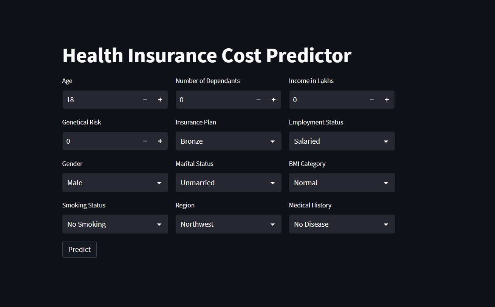
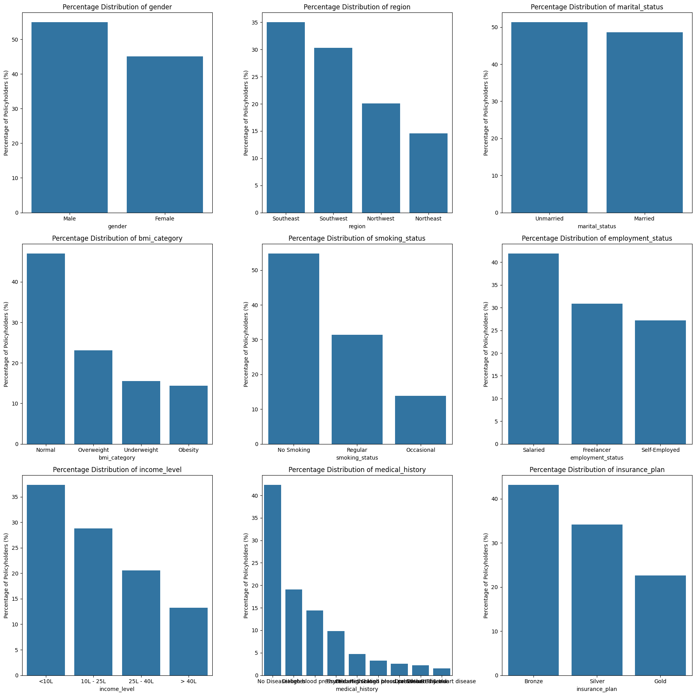
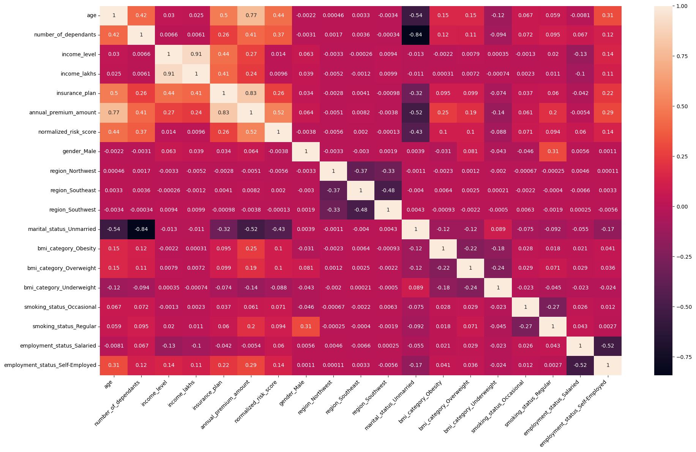
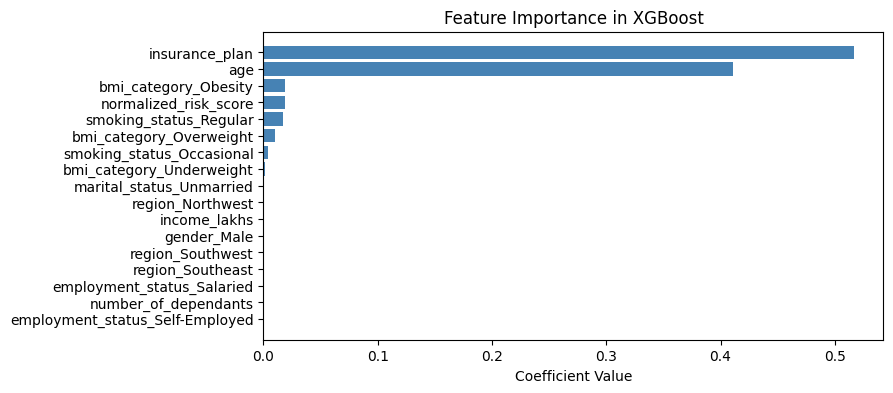

# 🏥 Health Insurance Premium Predictor

A machine learning project that predicts annual health insurance premium amounts based on customer demographics, lifestyle factors, and medical history. Includes an interactive web application for real-time predictions.

---

## 📌 Project Overvie

Insurance companies rely on accurate premium pricing to remain profitable while staying competitive. This project builds a regression-based ML pipeline that predicts the **Annual Premium Amount** for health insurance customers in India. 

Key insight discovered during analysis: **young customers (age ≤ 25) behave differently** from the rest of the population, leading to a **segmented modelling strategy** — separate models are trained for each group to improve accuracy.

---

## 📊 Dataset

Dataset contains **50,000 records** with features like:
- Age, Gender, Region  
- BMI Category, Smoking Status  
- Income, Employment  
- Medical History  
- Insurance Plan  

🎯 Target: **Annual_Premium_Amount**

---

## 📊 Exploratory Data Analysis

## Multi-Feature Distribution Plot

📌 This visualization shows the percentage distribution of key categorical features:
- Gender, Region, Marital Status  
- BMI Category, Smoking Status  
- Employment, Income Level  
- Medical History, Insurance Plan  

### 🔥 Correlation Heatmap

### 📈 Feature Importance

---

## 🔍 Methodology

### 1. Exploratory Data Analysis
- Distribution analysis  
- Correlation heatmaps  
- Outlier detection  

### 2. Data Segmentation
- Young Customers (≤ 25)  
- Rest Customers (> 25)  

### 3. Feature Engineering
- Label encoding  
- VIF analysis  
- Feature scaling  

### 4. Model Training
Models evaluated:
- **Linear Regression**
- **Ridge Regression**
- **Lasso Regression**
- **XGBoost**

---

## 🖥️ Web Application

An interactive **Health Insurance Cost Predictor** app built using **Streamlit**.

### How it Works:
1. User inputs customer details  
2. Model selection based on age segment  
3. Random Forest / Regression model predicts premium  
4. Result displayed instantly  

---

## ⚙️ Tech Stack

| Category | Tools |
|---|---|
| Language | Python 3.10 |
| Data Processing | Pandas, NumPy |
| Visualization | Matplotlib, Seaborn |
| Machine Learning | Scikit-learn |
| Statistical Analysis | Statsmodels |
| Web App | **Streamlit** |
| Notebook | Jupyter Notebook |

---

## 📈 Results

- Segmented modeling improved accuracy  
- XGBoost outperformed all models  
- Better predictions for young customers  
- Reduced error using feature engineering  

---

## 🚀 Future Improvements

- Improve UI/UX  
- Add API integration  

---

## 👤 Author

**Gaurav Rajput**
